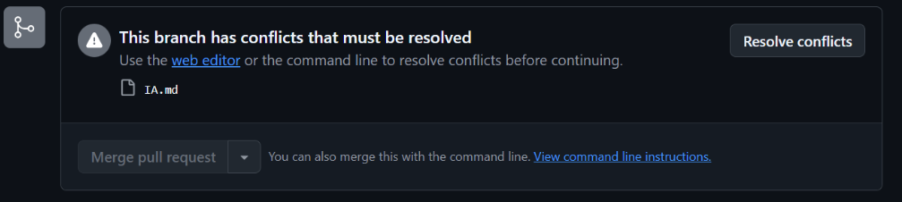

### Estadísticas de Participación: @tomisanti05

* **Total de commits:** 18
* **Desglose de uso de comandos en el historial:**
  * Implementación de nuevas secciones (uso de `feat:` y `git add`).
  * Resolución de conflictos de código manual (uso de `fix:`).
  * Limpieza de repositorio y archivos temporales (uso de `chore:`).
  * Ejecución exitosa de integraciones (`git merge` y `git rebase`).
  * Reversión de cambios en el historial (`git revert`).

  ### Estadisticas de Participación: @ianmanfredi

* **Total de commits:** 8
* **Desglose de uso de comandos en el historial:**
  * Implementacion de nuevas secciones sobre comandos locales y remotos (uso de `feat:`, `git add` y `git commit`).
  * Creacion del archivo indice y declaracion del uso de IA (uso de `docs:`).
  * Resolucion de conflicto de codigo durante la integración de la rama (Merge).

#### Captura de un conflicto previo a su resolución
* **Hash del commit asociado:** `ce607b5`
* **Captura:**

